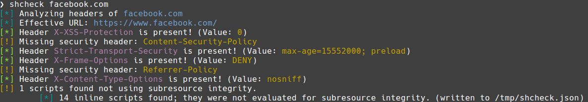

# shcheck

[](https://github.com/jakewarren/shcheck/releases])
[](https://github.com/jakewarren/shcheck/blob/master/LICENSE)
[](https://goreportcard.com/report/github.com/jakewarren/shcheck)
[](http://makeapullrequest.com)

> Check a URL for security headers

shcheck examines the HTTP response headers and source code for a variety of security headers. Basically a command line version of [https://securityheaders.io](https://securityheaders.io/) with a few bonus features.



## Install
### Option 1: Binary

Download the latest release from [https://github.com/jakewarren/shcheck/releases](https://github.com/jakewarren/shcheck/releases)

### Option 2: From source

```
go get github.com/jakewarren/shcheck
cd $GOPATH/src/github.com/jakewarren/shcheck
go run bootstrap.go
```

This will download the code into your GOPATH, and then run the bootstrap script to build mage with version infomation embedded in it. A normal `go get` (without -d) will build the binary correctly, but no version info will be embedded. If you've done this, no worries, just go to $GOPATH/src/github.com/jakewarren/shcheck and run `mage install` or `go run bootstrap.go` and a new binary will be created with the correct version information.

The shcheck binary will be created in your $GOPATH/bin directory.

## Usage

```
Usage: shcheck [<flags>] <URL to scan>

Optional flags:

  -A, --agent string   user agent to use for requests (default "shcheck/v1.0.0")
  -h, --help           display help
  -i, --insecure       disable SSL certificate validation
  -v, --verbose        display full info about headers
  -V, --version        display version

```


## Acknowledgements

[@traviscampbell](http://github.com/traviscampbell) - thanks for his contributions  
[meliot/shcheck](https://github.com/meliot/shcheck) - inspiration for the output format  
[riramar/hsecscan](https://github.com/riramar/hsecscan) - inspiration for the verbose output format

## Changes

All notable changes to this project will be documented in the [changelog].

The format is based on [Keep a Changelog](http://keepachangelog.com/) and this project adheres to [Semantic Versioning](http://semver.org/).

## License

MIT © 2017 Jake Warren

[changelog]: https://github.com/jakewarren/shcheck/blob/master/CHANGELOG.md
